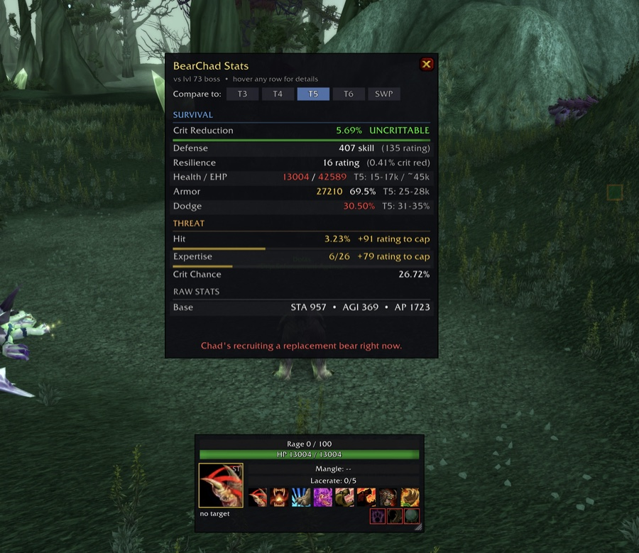

# BearChad

A druid bear tank co-pilot for TBC Classic. Tracks rotation, surfaces the next ability, and keeps your eyes on the boss instead of your bars — so warriors named Chad stop topping your threat meter.

## Features

### Rotation HUD
- **Next-ability suggester** with a one-line reason ("apply Mangle", "stack Lacerate 3/5", "queue Maul", "auto-attack — build rage").
- **Auto AoE detection** — hybrid algorithm that unions threat-filtered nameplate scan with a 5s combat-log GUID pool. Asymmetric debouncing (0.5s up, 2.5s down) prevents flapping. Manual override via `/bc aoe on | off | auto`.
- **Mangle on cooldown** prioritized; **Maul gated by rage** (≥50 ST / ≥70 AoE) and never starves your next Mangle. **FFF respects its 40s armor debuff** (no wasteful 6s recasts). **Clearcasting (Omen of Clarity)** overrides rage gates on every GCD ability.
- **Rage bar** with cap warning, **HP bar** with green/yellow/red thresholds.
- **Mangle debuff timer** and **Lacerate stack bar** (turns red at 5/5 so you stop stacking).
- **Cooldown row**: Mangle, Growl, Bash, Enrage, Demoralizing Roar, Challenging Roar, Frenzied Regen, Barkskin.
- **Buff row**: Mark of the Wild, Thorns, Omen of Clarity. Yellow countdown when ≤60s remain, pulsing red when ≤30s, dim grey + red border when missing.
- **`MAUL QUEUED`** indicator inside the rage bar; **NOT IN BEAR FORM** alert overlaid on the suggester. Suggester border flips cyan during a Clearcasting proc.

### Stats panel (`/bc stats`)
- **SURVIVAL section**: Crit Reduction (with progress bar vs the 5.60% UNCRITTABLE cap, computed from defense + resilience + auto-detected Survival of the Fittest talent), Defense, Resilience, Health / EHP, Armor, Dodge.
- **THREAT section**: Hit (with progress bar vs the 9% cap), Expertise (vs the 26-skill cap), Crit Chance.
- **Tier comparison selector**: T3 / T4 / T5 / T6 / SWP. HP / Armor / Dodge values turn **red** when below tier, **yellow** when in range, **green** when above. Instant "am I geared for this content yet?" check.
- **Hover tooltips** on every row explaining what the stat does and where its cap comes from.
- **Chad verdict line** at the bottom — randomized roast or respect from a 75+ line pool of druid/bear humor based on whether your aggregate stats are below, within, or above the selected tier.

## Priority

### Single target
1. Mangle on cooldown
2. Lacerate to 5 stacks
3. Lacerate refresh before falloff
4. Faerie Fire (Feral) if debuff missing/expiring
5. Maul (rage ≥ 50 and not already queued)
6. Auto-attack — build rage

### AoE
1. Demoralizing Roar refresh
2. Swipe (rage ≥ 20)
3. Mangle on cooldown on focus
4. Faerie Fire (Feral) if debuff missing
5. Maul (rage ≥ 70 and not already queued)

## Install

1. Download the latest zip from [Releases](../../releases) (or from CurseForge).
2. Extract the `BearChad` folder into `World of Warcraft/_classic_/Interface/AddOns/`.
3. `/reload` or restart the game.

## Slash commands

| Command | Effect |
|---|---|
| `/bc stats` | Toggle the stats panel |
| `/bc aoe on \| off \| auto` | Manual AoE-mode override |
| `/bc unlock` | Enable Shift+drag to move, Shift+drag corner to resize |
| `/bc lock` | Lock in place |
| `/bc scale 1.4` | Set scale (0.5–2.5) |
| `/bc reset` | Restore default position and scale |

## Compatibility

- **The Burning Crusade Classic (2.5.4)** — primary target
- Druid only
- Works alongside OmniCC (or with Blizzard's built-in cooldown countdown)

## License

Public domain ([Unlicense](LICENSE)).
